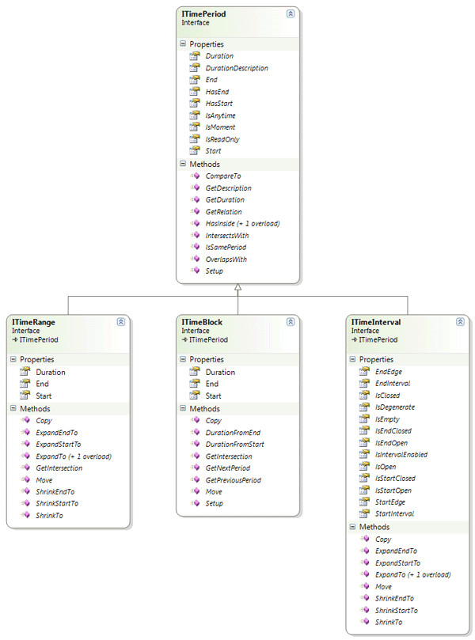
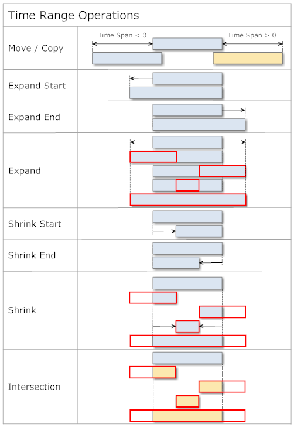
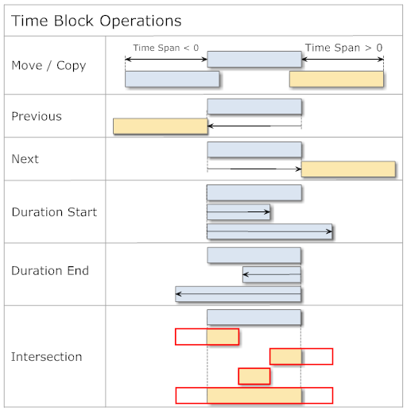
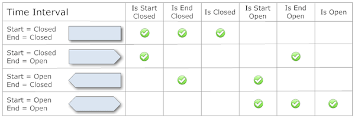
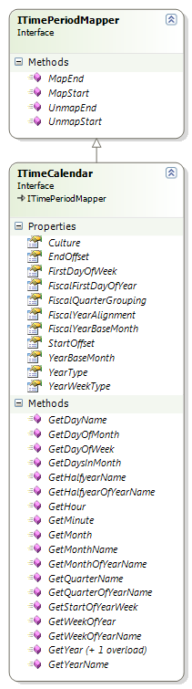
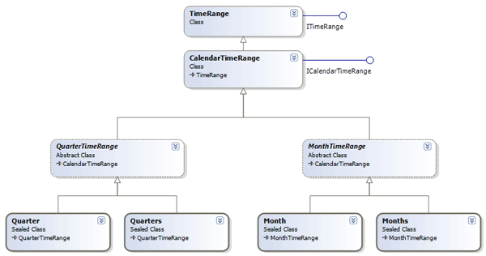
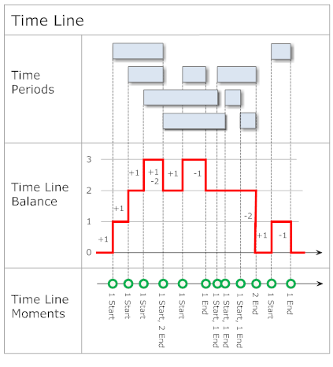
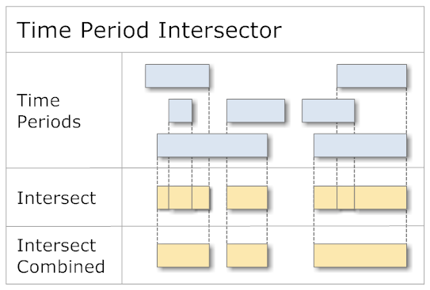
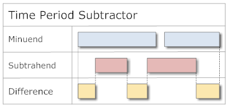
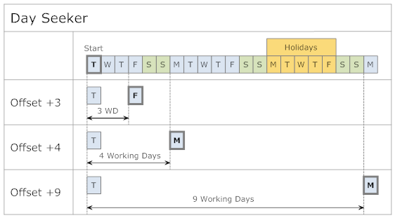

## Introduction
When implementing some software for another project, I came across several requirements involving calculations with time periods. These calculations were an important part of the solution and had high demands in respect to the correctness and accuracy of the results.

The required functionality covered the following areas:

*   Support for individual time periods
*   Working with calendar periods within calendar years
*   Working with calendar periods deviating from the calendar year (fiscal or school periods)
*   Working with the accounting and broadcast calendar

The time calculations should be made available to both server components (Web Services and tasks) as well as for a rich client (WPF and Silverlight) and mobile devices.

Analyzing the situation brought me to the conclusion that neither the components of the .NET Framework (which I didn't expect) nor any other available tools would cover all the requirements. Because I already encountered similar needs in earlier projects, I decided to develop a generic library for this purpose.

From several development cycles resulted the following library **Time Period**, which is now available for the following .NET runtime environments:

*   .NET Framework from Version 3.5 or newer
*   .NET Core Framework
*   .NET Mono Framework
*   Xamarin
*   Universal Windows Platform - UWP

## Time Periods
The .NET Framework already offers the extensive base classes `DateTime` and `TimeSpan` for basic time related calculations. The library **Time Period** extends the .NET Framework by several classes for handling periods of time. Such periods are basically characterized by a start, a duration, and an end:

<p align="center">
  
</p>

Per definition, the start always occurs before the end. The start is considered undefined if it holds the minimal possible value (`DateTime.MinValue`). Likewise, the end is undefined if it holds the maximal possible value (`DateTime.MaxValue`).

The implementation of these time periods is based on the interface `ITimePeriod` and extended by the specializations `ITimeRange`, `ITimeBlock` and and `ITimeInterval`:

<p align="center">
  
</p>

The interface `ITimePeriod` offers information and operations for time periods without defining the ways in which the crucial properties are being calculated:

*   `Start`, `End`, and `Duration` of the time period
*   `HasStart` is `true` if the `Start` time is defined
*   `HasEnd` is `true` if the `End` time is defined
*   `IsAnytime` is `true` if neither the `Start` nor the `End` times are defined
*   `IsMoment` is `true` if `Start` and `End` hold identical values
*   `IsReadOnly` is `true` for immutable time periods (for its usage, see below)

The relation of two time periods is described by the enumeration `PeriodRelation`:

<p align="center">
  
</p>

Methods like `IsSamePeriod`, `HasInside`, `OverlapsWith`, or `IntersectsWith` are available for convenience to query for special, often used variants of such period relations.

### Time Range
`TimeRange` as an implementation of `ITimeRange` defines the time period by its `Start` and `End`; the duration is calculated from these:

<p align="center">
  
</p>

A `TimeRange` can be created by specifying its `Start`/`End`, `Start`/`Duration`, or `Duration`/`End`. If required, the given `Start` and `End` will be sorted chronologically.

For the modification of such a time period, various operations are available (Orange = new instance):

<p align="center">
  
</p>

The following example shows the usage of `TimeRange`:

```csharp
public void TimeRangeSample()
{
  // --- time range 1 ---
  TimeRange timeRange1 = new TimeRange(
    new DateTime( 2011, 2, 22, 14, 0, 0 ),
    new DateTime( 2011, 2, 22, 18, 0, 0 ) );
  Console.WriteLine( "TimeRange1: " + timeRange1 );
  // > TimeRange1: 22.02.2011 14:00:00 - 18:00:00 | 04:00:00

  // --- time range 2 ---
  TimeRange timeRange2 = new TimeRange(
    new DateTime( 2011, 2, 22, 15, 0, 0 ),
    new TimeSpan( 2, 0, 0 ) );
  Console.WriteLine( "TimeRange2: " + timeRange2 );
  // > TimeRange2: 22.02.2011 15:00:00 - 17:00:00 | 02:00:00

  // --- time range 3 ---
  TimeRange timeRange3 = new TimeRange(
    new DateTime( 2011, 2, 22, 16, 0, 0 ),
    new DateTime( 2011, 2, 22, 21, 0, 0 ) );
  Console.WriteLine( "TimeRange3: " + timeRange3 );
  // > TimeRange3: 22.02.2011 16:00:00 - 21:00:00 | 05:00:00

  // --- relation ---
  Console.WriteLine( "TimeRange1.GetRelation( TimeRange2 ): " +
                     timeRange1.GetRelation( timeRange2 ) );
  // > TimeRange1.GetRelation( TimeRange2 ): Enclosing
  Console.WriteLine( "TimeRange1.GetRelation( TimeRange3 ): " +
                     timeRange1.GetRelation( timeRange3 ) );
  // > TimeRange1.GetRelation( TimeRange3 ): EndInside
  Console.WriteLine( "TimeRange3.GetRelation( TimeRange2 ): " +
                     timeRange3.GetRelation( timeRange2 ) );
  // > TimeRange3.GetRelation( TimeRange2 ): StartInside

  // --- intersection ---
  Console.WriteLine( "TimeRange1.GetIntersection( TimeRange2 ): " +
                     timeRange1.GetIntersection( timeRange2 ) );
  // > TimeRange1.GetIntersection( TimeRange2 ):
  //             22.02.2011 15:00:00 - 17:00:00 | 02:00:00
  Console.WriteLine( "TimeRange1.GetIntersection( TimeRange3 ): " +
                     timeRange1.GetIntersection( timeRange3 ) );
  // > TimeRange1.GetIntersection( TimeRange3 ):
  //             22.02.2011 16:00:00 - 18:00:00 | 02:00:00
  Console.WriteLine( "TimeRange3.GetIntersection( TimeRange2 ): " +
                     timeRange3.GetIntersection( timeRange2 ) );
  // > TimeRange3.GetIntersection( TimeRange2 ):
  //             22.02.2011 16:00:00 - 17:00:00 | 01:00:00
}
```

The following example tests whether a reservation is within the working hours of a day:
```csharp
public bool IsValidReservation( DateTime start, DateTime end )
{
  if ( !TimeCompare.IsSameDay( start, end ) )
  {
    return false;  // multiple day reservation
  }

  TimeRange workingHours =
    new TimeRange( TimeTrim.Hour( start, 8 ), TimeTrim.Hour( start, 18 ) );
  return workingHours.HasInside( new TimeRange( start, end ) );
}
```

### Time Block
`TimeBlock` implements the interface `ITimeBlock` and defines the time period by `Start` and `Duration`; the `End` is being calculated:

<p align="center">
  
</p>

As with `TimeRange`, a `TimeBlock` can be created with `Start`/`End`, `Start`/`Duration`, or `Duration`/`End`. As above, `Start` and `End` will be automatically sorted if necessary.

For the modification of a time block, these operations are available (Orange = new instance):

<p align="center">
  
</p>

The following example shows the usage of `TimeBlock`:
```csharp
public void TimeBlockSample()
{
  // --- time block ---
  TimeBlock timeBlock = new TimeBlock(
    new DateTime( 2011, 2, 22, 11, 0, 0 ),
    new TimeSpan( 2, 0, 0 ) );
  Console.WriteLine( "TimeBlock: " + timeBlock );
  // > TimeBlock: 22.02.2011 11:00:00 - 13:00:00 | 02:00:00

  // --- modification ---
  timeBlock.Start = new DateTime( 2011, 2, 22, 15, 0, 0 );
  Console.WriteLine( "TimeBlock.Start: " + timeBlock );
  // > TimeBlock.Start: 22.02.2011 15:00:00 - 17:00:00 | 02:00:00
  timeBlock.Move( new TimeSpan( 1, 0, 0 ) );
  Console.WriteLine( "TimeBlock.Move(1 hour): " + timeBlock );
  // > TimeBlock.Move(1 hour): 22.02.2011 16:00:00 - 18:00:00 | 02:00:00

  // --- previous/next ---
  Console.WriteLine( "TimeBlock.GetPreviousPeriod(): " +
                     timeBlock.GetPreviousPeriod() );
  // > TimeBlock.GetPreviousPeriod(): 22.02.2011 14:00:00 - 16:00:00 | 02:00:00
  Console.WriteLine( "TimeBlock.GetNextPeriod(): " + timeBlock.GetNextPeriod() );
  // > TimeBlock.GetNextPeriod(): 22.02.2011 18:00:00 - 20:00:00 | 02:00:00
  Console.WriteLine( "TimeBlock.GetNextPeriod(+1 hour): " +
                     timeBlock.GetNextPeriod( new TimeSpan( 1, 0, 0 ) ) );
  // > TimeBlock.GetNextPeriod(+1 hour): 22.02.2011 19:00:00 - 21:00:00 | 02:00:00
  Console.WriteLine( "TimeBlock.GetNextPeriod(-1 hour): " +
                     timeBlock.GetNextPeriod( new TimeSpan( -1, 0, 0 ) ) );
  // > TimeBlock.GetNextPeriod(-1 hour): 22.02.2011 17:00:00 - 19:00:00 | 02:00:00
}
```

### Time Interval
`ITimeInterval` determines its period of time like `ITimeRange` with a `Start` and an `End`. In addition, it is possible to control the interpretation of its `Start` and `End` by the enumeration `IntervalEdge`:

*   `Closed`: The boundary moment of time is included in calculations. This corresponds to the behavior of `ITimeRange`.
*   `Open`: The boundary moment of time represents a boundary value which is excluded in regard to calculations.

The possible interval variants look as follows:

<p align="center">
  
</p>

Normally, edges in interval periods have the value `IntervalEdge.Closed`, which leads to an intersection point with adjacent time periods. As soon as one of the adjacent points has its value set to `IntervalEdge.Open`, no intersection point exists:
```csharp
public void TimeIntervalSample()
{
  // --- time interval 1 ---
  TimeInterval timeInterval1 = new TimeInterval(
    new DateTime( 2011, 5, 8 ),
    new DateTime( 2011, 5, 9 ) );
  Console.WriteLine( "TimeInterval1: " + timeInterval1 );
  // > TimeInterval1: \[08.05.2011 - 09.05.2011\] | 1.00:00

  // --- time interval 2 ---
  TimeInterval timeInterval2 = new TimeInterval(
    timeInterval1.End,
    timeInterval1.End.AddDays( 1 ) );
  Console.WriteLine( "TimeInterval2: " + timeInterval2 );
  // > TimeInterval2: \[09.05.2011 - 10.05.2011\] | 1.00:00

  // --- relation ---
  Console.WriteLine( "Relation: " + timeInterval1.GetRelation( timeInterval2 ) );
  // > Relation: EndTouching
  Console.WriteLine( "Intersection: " +
                     timeInterval1.GetIntersection( timeInterval2 ) );
  // > Intersection: \[09.05.2011\]

  timeInterval1.EndEdge = IntervalEdge.Open;
  Console.WriteLine( "TimeInterval1: " + timeInterval1 );
  // > TimeInterval1: \[08.05.2011 - 09.05.2011) | 1.00:00

  timeInterval2.StartEdge = IntervalEdge.Open;
  Console.WriteLine( "TimeInterval2: " + timeInterval2 );
  // > TimeInterval2: (09.05.2011 - 10.05.2011\] | 1.00:00

  // --- relation ---
  Console.WriteLine( "Relation: " + timeInterval1.GetRelation( timeInterval2 ) );
  // > Relation: Before
  Console.WriteLine( "Intersection: " +
                     timeInterval1.GetIntersection( timeInterval2 ) );
  // > Intersection:
}
```

For certain scenarios, as for example the search for gaps in time periods, the exclusion of period edges can lead to undesired results. In such situations, it is possible to turn off this exclusion by setting the property `IsIntervalEnabled`.

Time intervals without boundaries can be created using the value `TimeSpec.MinPeriodDate` for `Start`, and `TimeSpec.MaxPeriodDate` for `End`.

## Time Period Container
In everyday usage, time calculations often involve several periods which can be collected in a container and operated upon as a whole. The **Time Period** library offers the following containers for time periods:

<p align="center">
  
</p>

All containers are based on the interface `ITimePeriod`, so containers themselves represent a time period. Like this, they can be used in calculations like other periods, for example, `ITimeRange`.

The interface `ITimePeriodContainer` serves as the base for all containers, and offers list functionality by deriving from `IList<ITimePeriod>`.

### Time Period Collection
A `ITimePeriodCollection` can hold arbitrary elements of type `ITimePeriod` and interprets the earliest start of all its elements as the start of the collection time period. Correspondingly, the latest end of all its elements serves as the end of the collection period:

<p align="center">
  
</p>

The time period collection offers the following operations:

<p align="center">
  
</p>

The following example shows the usage of the class `TimePeriodCollection`, which implements the interface `ITimePeriodCollection`:
```csharp
public void TimePeriodCollectionSample()
{
  TimePeriodCollection timePeriods = new TimePeriodCollection();

  DateTime testDay = new DateTime( 2010, 7, 23 );

  // --- items ---
  timePeriods.Add( new TimeRange( TimeTrim.Hour( testDay, 8 ),
                   TimeTrim.Hour( testDay, 11 ) ) );
  timePeriods.Add( new TimeBlock( TimeTrim.Hour( testDay, 10 ), Duration.Hours( 3 ) ) );
  timePeriods.Add( new TimeRange( TimeTrim.Hour( testDay, 16, 15 ),
                   TimeTrim.Hour( testDay, 18, 45 ) ) );
  timePeriods.Add( new TimeRange( TimeTrim.Hour( testDay, 14 ),
                   TimeTrim.Hour( testDay, 15, 30 ) ) );
  Console.WriteLine( "TimePeriodCollection: " + timePeriods );
  // > TimePeriodCollection: Count = 4; 23.07.2010 08:00:00 - 18:45:00 | 0.10:45
  Console.WriteLine( "TimePeriodCollection.Items" );
  foreach ( ITimePeriod timePeriod in timePeriods )
  {
    Console.WriteLine( "Item: " + timePeriod );
  }
  // > Item: 23.07.2010 08:00:00 - 11:00:00 | 03:00:00
  // > Item: 23.07.2010 10:00:00 - 13:00:00 | 03:00:00
  // > Item: 23.07.2010 16:15:00 - 18:45:00 | 02:30:00
  // > Item: 23.07.2010 14:00:00 - 15:30:00 | 01:30:00

  // --- intersection by moment ---
  DateTime intersectionMoment = new DateTime( 2010, 7, 23, 10, 30, 0 );
  ITimePeriodCollection momentIntersections =
     timePeriods.IntersectionPeriods( intersectionMoment );
  Console.WriteLine( "TimePeriodCollection.IntesectionPeriods of " +
                     intersectionMoment );
  // > TimePeriodCollection.IntesectionPeriods of 23.07.2010 10:30:00
  foreach ( ITimePeriod momentIntersection in momentIntersections )
  {
    Console.WriteLine( "Intersection: " + momentIntersection );
  }
  // > Intersection: 23.07.2010 08:00:00 - 11:00:00 | 03:00:00
  // > Intersection: 23.07.2010 10:00:00 - 13:00:00 | 03:00:00

  // --- intersection by period ---
  TimeRange intersectionPeriod =
    new TimeRange( TimeTrim.Hour( testDay, 9 ),
                   TimeTrim.Hour( testDay, 14, 30 ) );
  ITimePeriodCollection periodIntersections =
    timePeriods.IntersectionPeriods( intersectionPeriod );
  Console.WriteLine( "TimePeriodCollection.IntesectionPeriods of " +
                     intersectionPeriod );
  // > TimePeriodCollection.IntesectionPeriods
  //      of 23.07.2010 09:00:00 - 14:30:00 | 0.05:30
  foreach ( ITimePeriod periodIntersection in periodIntersections )
  {
    Console.WriteLine( "Intersection: " + periodIntersection );
  }
  // > Intersection: 23.07.2010 08:00:00 - 11:00:00 | 03:00:00
  // > Intersection: 23.07.2010 10:00:00 - 13:00:00 | 03:00:00
  // > Intersection: 23.07.2010 14:00:00 - 15:30:00 | 01:30:00
}
```

### Time Period Chain
`ITimePeriodChain` connects several time periods of type `ITimePeriod` in a chain and ensures that no gaps exist between successive periods:

<p align="center">
  
</p>

Because `ITimePeriodChain` might change the position of elements, no read-only time periods can be added. Attempting this leads to a `NotSupportedException`. `ITimePeriodChain` offers the following functionality:

<p align="center">
  
</p>

The following example shows the usage of class `TimePeriodChain`, which implements the interface `ITimePeriodChain`:
```csharp
public void TimePeriodChainSample()
{
  TimePeriodChain timePeriods = new TimePeriodChain();

  DateTime now = ClockProxy.Clock.Now;
  DateTime testDay = new DateTime( 2010, 7, 23 );

  // --- add ---
  timePeriods.Add( new TimeBlock(
                   TimeTrim.Hour( testDay, 8 ), Duration.Hours( 2 ) ) );
  timePeriods.Add( new TimeBlock( now, Duration.Hours( 1, 30 ) ) );
  timePeriods.Add( new TimeBlock( now, Duration.Hour ) );
  Console.WriteLine( "TimePeriodChain.Add(): " + timePeriods );
  // > TimePeriodChain.Add(): Count = 3; 23.07.2010 08:00:00 - 12:30:00 | 0.04:30
  foreach ( ITimePeriod timePeriod in timePeriods )
  {
    Console.WriteLine( "Item: " + timePeriod );
  }
  // > Item: 23.07.2010 08:00:00 - 10:00:00 | 02:00:00
  // > Item: 23.07.2010 10:00:00 - 11:30:00 | 01:30:00
  // > Item: 23.07.2010 11:30:00 - 12:30:00 | 01:00:00

  // --- insert ---
  timePeriods.Insert( 2, new TimeBlock( now, Duration.Minutes( 45 ) ) );
  Console.WriteLine( "TimePeriodChain.Insert(): " + timePeriods );
  // > TimePeriodChain.Insert(): Count = 4; 23.07.2010 08:00:00 - 13:15:00 | 0.05:15
  foreach ( ITimePeriod timePeriod in timePeriods )
  {
    Console.WriteLine( "Item: " + timePeriod );
  }
  // > Item: 23.07.2010 08:00:00 - 10:00:00 | 02:00:00
  // > Item: 23.07.2010 10:00:00 - 11:30:00 | 01:30:00
  // > Item: 23.07.2010 11:30:00 - 12:15:00 | 00:45:00
  // > Item: 23.07.2010 12:15:00 - 13:15:00 | 01:00:00
}
```

## Calendar Time Periods
Calculations with calendar periods must consider the peculiarity that the end of a time period doesn't equal the start of the following period. The following example shows the corresponding values for the hours of day between 13h and 15h:

*   `13:00:00.0000000` - `13:59:59.9999999`
*   `14:00:00.0000000` - `14:59:59.9999999`

The end lies a moment before the next start, the difference between the two is at least 1 Tick = 100 nanoseconds. This is an important aspect and may not be neglected in calculations involving time periods.

The **Time Period** library offers the interface `ITimePeriodMapper`, which can convert moments of a time period in both directions. Applied to the scenario above, this would be handled as follows:
```csharp
public void TimePeriodMapperSample()
{
  TimeCalendar timeCalendar = new TimeCalendar();
  CultureInfo ci = CultureInfo.InvariantCulture;

  DateTime start = new DateTime( 2011, 3, 1, 13, 0, 0 );
  DateTime end = new DateTime( 2011, 3, 1, 14, 0, 0 );

  Console.WriteLine( "Original start: {0}",
                     start.ToString( "HH:mm:ss.fffffff", ci ) );
  // > Original start: 13:00:00.0000000
  Console.WriteLine( "Original end: {0}",
                     end.ToString( "HH:mm:ss.fffffff", ci ) );
  // > Original end: 14:00:00.0000000

  Console.WriteLine( "Mapping offset start: {0}", timeCalendar.StartOffset );
  // > Mapping offset start: 00:00:00
  Console.WriteLine( "Mapping offset end: {0}", timeCalendar.EndOffset );
  // > Mapping offset end: -00:00:00.0000001

  Console.WriteLine( "Mapped start: {0}",
    timeCalendar.MapStart( start ).ToString( "HH:mm:ss.fffffff", ci ) );
  // > Mapped start: 13:00:00.0000000
  Console.WriteLine( "Mapped end: {0}",
    timeCalendar.MapEnd( end ).ToString( "HH:mm:ss.fffffff", ci ) );
  // > Mapped end: 13:59:59.9999999
}
```
 
### Time Calendar
The task of interpretation of time periods of calendar elements is combined in the interface `ITimeCalendar`:

<p align="center">
  
</p>

`ITimeCalendar` covers the following areas:

*   Assignment to a `CultureInfo` (default = `CultureInfo` of the current thread)
*   Mapping of period boundaries (`ITimePeriodMapper`)
*   Base month of the year (default = January)
*   Definition of how to interpret calendar weeks
*   Definition for accounting calendar
*   Naming of periods like, for example, the name of the year (fiscal year, school year, ...)
*   Various calendar related calculations

Deriving from `ITimePeriodMapper`, the mapping of time period boundaries happens with the properties `StartOffset` (default = 0) and `EndOffset` (default = -1 Tick).

The following example shows a specialization of a time calendar for a fiscal year:
```csharp
public class FiscalTimeCalendar : TimeCalendar
{
  public FiscalTimeCalendar(): 
  base(
      new TimeCalendarConfig
      {
        YearBaseMonth = YearMonth.October,  //  October year base month
        YearWeekType = YearWeekType.Iso8601, // ISO 8601 week numbering
        YearType = YearType.FiscalYear // treat years as fiscal years
      } )
  {
  }
}
```

This time calendar can now be used as follows:
```csharp
public void FiscalYearSample()
{
  FiscalTimeCalendar calendar = new FiscalTimeCalendar(); // use fiscal periods

  DateTime moment1 = new DateTime( 2006, 9, 30 );
  Console.WriteLine( "Fiscal Year of {0}: {1}", moment1.ToShortDateString(),
                     new Year( moment1, calendar ).YearName );
  // > Fiscal Year of 30.09.2006: FY2005
  Console.WriteLine( "Fiscal Quarter of {0}: {1}", moment1.ToShortDateString(),
                     new Quarter( moment1, calendar ).QuarterOfYearName );
  // > Fiscal Quarter of 30.09.2006: FQ4 2005

  DateTime moment2 = new DateTime( 2006, 10, 1 );
  Console.WriteLine( "Fiscal Year of {0}: {1}", moment2.ToShortDateString(),
                     new Year( moment2, calendar ).YearName );
  // > Fiscal Year of 01.10.2006: FY2006
  Console.WriteLine( "Fiscal Quarter of {0}: {1}", moment1.ToShortDateString(),
                     new Quarter( moment2, calendar ).QuarterOfYearName );
  // > Fiscal Quarter of 30.09.2006: FQ1 2006
}
```
A more thorough description of the classes `Year` and `Quarter` follows below.

### Calendar Elements
For the most commonly used calendar elements, specialized classes are available:
| Time period | Single period | Multiple periods | Refers to year's base month |
|---|:---:|:---:|:---:|
| Year | `Year` | `Years` | Yes |
| Broadcast year| `BroadcastYear`| \-| No |
| Half year | `Halfyear` | `Halfyears` | Yes |
| Quarter | `Quarter` | `Quarters` | Yes |
| Month |`Month` | `Months` | No |
| Broadcast month | `BroadcastMonth` | \- | No |
| Week | `Week` | `Weeks` | No |
| Broadcast week | `BroadcastWeek` | \- | No |
| Day | `Day` | `Days` | No |
| Hour | `Hour` | `Hours` | No |
| Minute | `Minute` | `Minutes` | No |

Instantiating elements with multiple periods can happen with a specified number of periods.

The following diagram shows the calendar elements for quarters and months, other elements are analogous:

<p align="center">
  
</p>

All calendar elements derive from the base class `CalendarTimeRange` which itself derives from `TimeRange`. `CalendarTimeRange` contains the time calendar `ITimeCalendar` and thus ensures that the values of the time period cannot be changed after creation (`IsReadOnly=true`).

Because by inheritance through the base class `TimePeriod`, the calendar elements implement the interface `ITimePeriod`, they can all be used for calculations with other time periods.

The following example shows various calendar elements:
```csharp
public void CalendarYearTimePeriodsSample()
{
  DateTime moment = new DateTime( 2011, 8, 15 );
  Console.WriteLine( "Calendar Periods of {0}:", moment.ToShortDateString() );
  // > Calendar Periods of 15.08.2011:
  Console.WriteLine( "Year     : {0}", new Year( moment ) );
  Console.WriteLine( "Halfyear : {0}", new Halfyear( moment ) );
  Console.WriteLine( "Quarter  : {0}", new Quarter( moment ) );
  Console.WriteLine( "Month    : {0}", new Month( moment ) );
  Console.WriteLine( "Week     : {0}", new Week( moment ) );
  Console.WriteLine( "Day      : {0}", new Day( moment ) );
  Console.WriteLine( "Hour     : {0}", new Hour( moment ) );
  // > Year     : 2011; 01.01.2011 - 31.12.2011 | 364.23:59
  // > Halfyear : HY2 2011; 01.07.2011 - 31.12.2011 | 183.23:59
  // > Quarter  : Q3 2011; 01.07.2011 - 30.09.2011 | 91.23:59
  // > Month    : August 2011; 01.08.2011 - 31.08.2011 | 30.23:59
  // > Week     : w/c 33 2011; 15.08.2011 - 21.08.2011 | 6.23:59
  // > Day      : Montag; 15.08.2011 - 15.08.2011 | 0.23:59
  // > Hour     : 15.08.2011; 00:00 - 00:59 | 0.00:59
}
```

Some specific calendar elements offer methods to access the time periods of their sub-elements. The following example shows the quarters of a calendar year:
```csharp
public void YearQuartersSample()
{
  Year year = new Year( 2012 );
  ITimePeriodCollection quarters = year.GetQuarters();
  Console.WriteLine( "Quarters of Year: {0}", year );
  // > Quarters of Year: 2012; 01.01.2012 - 31.12.2012 | 365.23:59
  foreach ( Quarter quarter in quarters )
  {
    Console.WriteLine( "Quarter: {0}", quarter );
  }
  // > Quarter: Q1 2012; 01.01.2012 - 31.03.2012 | 90.23:59
  // > Quarter: Q2 2012; 01.04.2012 - 30.06.2012 | 90.23:59
  // > Quarter: Q3 2012; 01.07.2012 - 30.09.2012 | 91.23:59
  // > Quarter: Q4 2012; 01.10.2012 - 31.12.2012 | 91.23:59
}
```

### Year and Year Periods
A peculiarity of the calendar elements is their support for calendar periods which deviate from (normal) calendar years:

<p align="center">
  
</p>

The beginning of the year can be set through the property `ITimeCalendar.YearBaseMonth` and will be considered by the calendar elements Year, Half Year, and Quarter. Valid values for the start of a year can be an arbitrary month. The calendar year thus simply represents the special case where `YearBaseMonth = YearMonth.January`.

The following properties govern the interpretation of the boundaries between years:

*   `MultipleCalendarYears` holds `true` if a period spans over multiple calendar years
*   `IsCalendarYear`/`Halfyear`/`Quarter` holds `true` if a period corresponds the one of the calendar year

Fiscal years which start in July or later conventionally use the year number of the following calendar year. The calendar property `FiscalYearBaseMonth` offers the possibility to define the month, after which the fiscal year will be assigned the following calendar year.

The following example shows the calendar elements of a fiscal year:
```csharp
public void FiscalYearTimePeriodsSample()
{
  DateTime moment = new DateTime( 2011, 8, 15 );
  FiscalTimeCalendar fiscalCalendar = new FiscalTimeCalendar();
  Console.WriteLine( "Fiscal Year Periods of {0}:", moment.ToShortDateString() );
  // > Fiscal Year Periods of 15.08.2011:
  Console.WriteLine( "Year     : {0}", new Year( moment, fiscalCalendar ) );
  Console.WriteLine( "Halfyear : {0}", new Halfyear( moment, fiscalCalendar ) );
  Console.WriteLine( "Quarter  : {0}", new Quarter( moment, fiscalCalendar ) );
  // > Year     : FY2010; 01.10.2010 - 30.09.2011 | 364.23:59
  // > Halfyear : FHY2 2010; 01.04.2011 - 30.09.2011 | 182.23:59
  // > Quarter  : FQ4 2010; 01.07.2011 - 30.09.2011 | 91.23:59
}
```

Moving the beginning of the year influences the outcome of all contained elements and their operations:
```csharp
public void YearStartSample()
{
  TimeCalendar calendar = new TimeCalendar(
    new TimeCalendarConfig { YearBaseMonth = YearMonth.February } );

  Years years = new Years( 2012, 2, calendar ); // 2012-2013
  Console.WriteLine( "Quarters of Years (February): {0}", years );
  // > Quarters of Years (February): 2012 - 2014; 01.02.2012 - 31.01.2014 | 730.23:59

  foreach ( Year year in years.GetYears() )
  {
    foreach ( Quarter quarter in year.GetQuarters() )
    {
      Console.WriteLine( "Quarter: {0}", quarter );
    }
  }
  // > Quarter: Q1 2012; 01.02.2012 - 30.04.2012 | 89.23:59
  // > Quarter: Q2 2012; 01.05.2012 - 31.07.2012 | 91.23:59
  // > Quarter: Q3 2012; 01.08.2012 - 31.10.2012 | 91.23:59
  // > Quarter: Q4 2012; 01.11.2012 - 31.01.2013 | 91.23:59
  // > Quarter: Q1 2013; 01.02.2013 - 30.04.2013 | 88.23:59
  // > Quarter: Q2 2013; 01.05.2013 - 31.07.2013 | 91.23:59
  // > Quarter: Q3 2013; 01.08.2013 - 31.10.2013 | 91.23:59
  // > Quarter: Q4 2013; 01.11.2013 - 31.01.2014 | 91.23:59
}
```

Following are some illustrative usages of often useful utility functions:
```csharp
public bool IntersectsYear( DateTime start, DateTime end, int year )
{
  return new Year( year ).IntersectsWith( new TimeRange( start, end ) );
}

public void GetDaysOfPastQuarter( DateTime moment,
       out DateTime firstDay, out DateTime lastDay )
{
  TimeCalendar calendar = new TimeCalendar(
    new TimeCalendarConfig { YearBaseMonth = YearMonth.October } );
  Quarter quarter = new Quarter( moment, calendar );
  Quarter pastQuarter = quarter.GetPreviousQuarter();

  firstDay = pastQuarter.FirstDayStart;
  lastDay = pastQuarter.LastDayStart;
}

public DateTime GetFirstDayOfWeek( DateTime moment )
{
  return new Week( moment ).FirstDayStart;
}

public bool IsInCurrentWeek( DateTime test )
{
  return new Week().HasInside( test );
}
```

### Weeks
Common practice numbers the weeks of a year from 1 to 52/53. The .NET Framework offers in `Calendar.GetWeekOfYear` a method to get at this number of the week for a given moment in time. Unfortunately, this deviates from the definition given in [ISO 8601](http://www.iso.org/iso/support/faqs/faqs_widely_used_standards/widely_used_standards_other/date_and_time_format.htm), which can lead to wrong interpretations and other misbehavior.

The **Time Period** library contains the enumeration `YearWeekType`, which controls the calculation of calendar week numbers according to ISO 8601. `YearWeekType` is supported by `ITimeCalendar` and thus defines the different ways of calculation:
```csharp
// see also http://blogs.msdn.com/b/shawnste/archive/2006/01/24/517178.aspx
public void CalendarWeekSample()
{
  DateTime testDate = new DateTime( 2007, 12, 31 );

  // .NET calendar week
  TimeCalendar calendar = new TimeCalendar();
  Console.WriteLine( "Calendar Week of {0}: {1}", testDate.ToShortDateString(),
                     new Week( testDate, calendar ).WeekOfYear );
  // > Calendar Week of 31.12.2007: 53

  // ISO 8601 calendar week
  TimeCalendar calendarIso8601 = new TimeCalendar(
    new TimeCalendarConfig { YearWeekType = YearWeekType.Iso8601 } );
  Console.WriteLine( "ISO 8601 Week of {0}: {1}", testDate.ToShortDateString(),
                     new Week( testDate, calendarIso8601 ).WeekOfYear );
  // > ISO 8601 Week of 31.12.2007: 1
} 
```

### Accounting Calendar
To simplify planning, accounting related industries often structure years into quarters which are composed of months with either four or five weeks ([4-4-5 calendar](http://en.wikipedia.org/wiki/4-4-5_Calendar)). Such a year is usually aligned to
*   the last week day of a month (`FiscalYearAlignment.LastDay`)
*   a week day close to the end of the month (`FiscalYearAlignment.NearestDay`)

Arrangement of the weeks occurs according to the following grouping criteria:
*   4-4-5 weeks (`FiscalQuarterGrouping.FourFourFiveWeeks`)
*   4-5-4 weeks (`FiscalQuarterGrouping.FourFiveFourWeeks`)
*   5-4-4 weeks (`FiscalQuarterGrouping.FiveFourFourWeeks`)

Control of this behavior is located in `ITimeCalendar` and only applies to fiscal years (`YearType.FiscalYear`). The calendar property `FiscalFirstDayOfYear` determines the week day on which a year begins.

The following example shows a fiscal year which ends on the last Saturday of August:
```csharp
public void FiscalYearLastDay()
{
  ITimeCalendar calendar = new TimeCalendar( new TimeCalendarConfig
  {
    YearType = YearType.FiscalYear,
    YearBaseMonth = YearMonth.September,
    FiscalFirstDayOfYear = DayOfWeek.Sunday,
    FiscalYearAlignment = FiscalYearAlignment.LastDay,
    FiscalQuarterGrouping = FiscalQuarterGrouping.FourFourFiveWeeks
  } );

  Years years = new Years( 2005, 14, calendar );
  foreach ( Year year in years.GetYears() )
  {
    Console.WriteLine( "Fiscal year {0}: {1} - {2}", year.YearValue,
      year.Start.ToString( "yyyy-MM-dd" ), year.End.ToString( "yyyy-MM-dd" ) );
  }
}
```

The following fiscal year ends on that Saturday which is closer to the end of August:
```csharp
public void FiscalYearNearestDay()
{
  ITimeCalendar calendar = new TimeCalendar( new TimeCalendarConfig
  {
    YearType = YearType.FiscalYear,
    YearBaseMonth = YearMonth.September,
    FiscalFirstDayOfYear = DayOfWeek.Sunday,
    FiscalYearAlignment = FiscalYearAlignment.NearestDay,
    FiscalQuarterGrouping = FiscalQuarterGrouping.FourFourFiveWeeks
  } );

  Years years = new Years( 2005, 14, calendar );
  foreach ( Year year in years.GetYears() )
  {
    Console.WriteLine( "Fiscal year {0}: {1} - {2}", year.YearValue,
      year.Start.ToString( "yyyy-MM-dd" ), year.End.ToString( "yyyy-MM-dd" ) );
  }
}
```

### Broadcast Calendar
The [Broadcast Calendar](http://en.wikipedia.org/wiki/Broadcast_calendar) is supported by the classes `BroadcastYear`, `BroadcastMonth` and `BroadcastWeek`:
```csharp
public void BroadcastCalendar()
{
  BroadcastYear year = new BroadcastYear( 2013 );
  Console.WriteLine( "Broadcast year: " + year );
  // > Broadcast year: 2013; 31.12.2012 - 29.12.2013 | 363.23:59
  foreach ( BroadcastMonth month in year.GetMonths() )
  {
    Console.WriteLine( " Broadcast month: " + month );
    foreach ( BroadcastWeek week in month.GetWeeks() )
    {
      Console.WriteLine( " Broadcast week: " + week );
    }
   }
}
```

## Time Period Calculation Tools

### Time Line
The class `TimeLine` is at the heart of calculations regarding time gaps and overlaps. It analyzes the time periods of a Collection by ordering them according to occurrence of the respective moments in time. Each moment on the time line is represented as an `ITimeLineMoment` and contains the information about which time periods start and end at a specific moment. This representation allows for keeping track of a running balance by addition and subtraction while processing a time line.

<p align="center">
  
</p>

The moments of the time axis are stored in the `ITimeLineMomentCollection` which allows efficient access for iteration and by index based on moments of time.

### Difference between Two Points of Time
The `TimeSpan` structure of the .NET Framework just offers the time range values for days, hours, minutes, seconds and milliseconds. From a user perspective, it is often desirable to also represent the months and years of a time range:
*   Last visit 1 year, 4 months and 12 days ago
*   Current age: 28 years

The **Time Period** library includes the class `DateDiff`, which calculates the difference in time between two date values and also offers access to the elapsed time range. This properly considers calendar periods to account for varying month durations:
```csharp
public void DateDiffSample()
{
  DateTime date1 = new DateTime( 2009, 11, 8, 7, 13, 59 );
  Console.WriteLine( "Date1: {0}", date1 );
  // > Date1: 08.11.2009 07:13:59
  DateTime date2 = new DateTime( 2011, 3, 20, 19, 55, 28 );
  Console.WriteLine( "Date2: {0}", date2 );
  // > Date2: 20.03.2011 19:55:28

  DateDiff dateDiff = new DateDiff( date1, date2 );

  // differences
  Console.WriteLine( "DateDiff.Years: {0}", dateDiff.Years );
  // > DateDiff.Years: 1
  Console.WriteLine( "DateDiff.Quarters: {0}", dateDiff.Quarters );
  // > DateDiff.Quarters: 5
  Console.WriteLine( "DateDiff.Months: {0}", dateDiff.Months );
  // > DateDiff.Months: 16
  Console.WriteLine( "DateDiff.Weeks: {0}", dateDiff.Weeks );
  // > DateDiff.Weeks: 70
  Console.WriteLine( "DateDiff.Days: {0}", dateDiff.Days );
  // > DateDiff.Days: 497
  Console.WriteLine( "DateDiff.Weekdays: {0}", dateDiff.Weekdays );
  // > DateDiff.Weekdays: 71
  Console.WriteLine( "DateDiff.Hours: {0}", dateDiff.Hours );
  // > DateDiff.Hours: 11940
  Console.WriteLine( "DateDiff.Minutes: {0}", dateDiff.Minutes );
  // > DateDiff.Minutes: 716441
  Console.WriteLine( "DateDiff.Seconds: {0}", dateDiff.Seconds );
  // > DateDiff.Seconds: 42986489

  // elapsed
  Console.WriteLine( "DateDiff.ElapsedYears: {0}", dateDiff.ElapsedYears );
  // > DateDiff.ElapsedYears: 1
  Console.WriteLine( "DateDiff.ElapsedMonths: {0}", dateDiff.ElapsedMonths );
  // > DateDiff.ElapsedMonths: 4
  Console.WriteLine( "DateDiff.ElapsedDays: {0}", dateDiff.ElapsedDays );
  // > DateDiff.ElapsedDays: 12
  Console.WriteLine( "DateDiff.ElapsedHours: {0}", dateDiff.ElapsedHours );
  // > DateDiff.ElapsedHours: 12
  Console.WriteLine( "DateDiff.ElapsedMinutes: {0}", dateDiff.ElapsedMinutes );
  // > DateDiff.ElapsedMinutes: 41
  Console.WriteLine( "DateDiff.ElapsedSeconds: {0}", dateDiff.ElapsedSeconds );
  // > DateDiff.ElapsedSeconds: 29

  // description
  Console.WriteLine( "DateDiff.GetDescription(1): {0}", dateDiff.GetDescription( 1 ) );
  // > DateDiff.GetDescription(1): 1 Year
  Console.WriteLine( "DateDiff.GetDescription(2): {0}", dateDiff.GetDescription( 2 ) );
  // > DateDiff.GetDescription(2): 1 Year 4 Months
  Console.WriteLine( "DateDiff.GetDescription(3): {0}", dateDiff.GetDescription( 3 ) );
  // > DateDiff.GetDescription(3): 1 Year 4 Months 12 Days
  Console.WriteLine( "DateDiff.GetDescription(4): {0}", dateDiff.GetDescription( 4 ) );
  // > DateDiff.GetDescription(4): 1 Year 4 Months 12 Days 12 Hours
  Console.WriteLine( "DateDiff.GetDescription(5): {0}", dateDiff.GetDescription( 5 ) );
  // > DateDiff.GetDescription(5): 1 Year 4 Months 12 Days 12 Hours 41 Mins
  Console.WriteLine( "DateDiff.GetDescription(6): {0}", dateDiff.GetDescription( 6 ) );
  // > DateDiff.GetDescription(6): 1 Year 4 Months 12 Days 12 Hours 41 Mins 29 Secs
}
```

The method `DateDiff.GetDescription` can format the time duration with variable level of detail.

### Time Gap Calculation

A `TimeGapCalculator` calculates the gaps between time periods in a collection:

<p align="center">
  
</p>

Interpretation of the moments of time can be subject to the application of a `ITimePeriodMapper`.

The following example shows how to find the largest possible gap between existing bookings while considering weekends as unavailable:
```csharp
public void TimeGapCalculatorSample()
{
  // simulation of some reservations
  TimePeriodCollection reservations = new TimePeriodCollection();
  reservations.Add( new Days( 2011, 3, 7, 2 ) );
  reservations.Add( new Days( 2011, 3, 16, 2 ) );

  // the overall search range
  CalendarTimeRange searchLimits = new CalendarTimeRange(
      new DateTime( 2011, 3, 4 ), new DateTime( 2011, 3, 21 ) );

  // search the largest free time block
  ICalendarTimeRange largestFreeTimeBlock =
      FindLargestFreeTimeBlock( reservations, searchLimits );
  Console.WriteLine( "Largest free time: " + largestFreeTimeBlock );
  // > Largest free time: 09.03.2011 00:00:00 - 11.03.2011 23:59:59 | 2.23:59
}

public ICalendarTimeRange FindLargestFreeTimeBlock(
       IEnumerable<ITimePeriod> reservations,
       ITimePeriod searchLimits = null, bool excludeWeekends = true )
{
  TimePeriodCollection bookedPeriods = new TimePeriodCollection( reservations );

  if ( searchLimits == null )
  {
    searchLimits = bookedPeriods; // use boundary of reservations
  }

  if ( excludeWeekends )
  {
    Week currentWeek = new Week( searchLimits.Start );
    Week lastWeek = new Week( searchLimits.End );
    do
    {
      ITimePeriodCollection days = currentWeek.GetDays();
      foreach ( Day day in days )
      {
        if ( !searchLimits.HasInside( day ) )
        {
          continue; // outside of the search scope
        }
        if ( day.DayOfWeek == DayOfWeek.Saturday ||
             day.DayOfWeek == DayOfWeek.Sunday )
        {
          bookedPeriods.Add( day ); // // exclude weekend day
        }
      }
      currentWeek = currentWeek.GetNextWeek();
    } while ( currentWeek.Start < lastWeek.Start );
  }

  // calculate the gaps using the time calendar as period mapper
  TimeGapCalculator<TimeRange> gapCalculator =
    new TimeGapCalculator<TimeRange>( new TimeCalendar() );
  ITimePeriodCollection freeTimes =
    gapCalculator.GetGaps( bookedPeriods, searchLimits );
  if ( freeTimes.Count == 0 )
  {
    return null;
  }

  freeTimes.SortByDuration(); // move the largest gap to the start
  return new CalendarTimeRange( freeTimes\[ 0 \] );
}
```

### Consolidation of Time Periods
In some situations, it is reasonable to have a consolidated view on overlapping or adjacent time periods - e.g., the contrary of finding gaps. The class `TimePeriodCombiner` offers this possibility to consolidate such time periods:

<p align="center">
  
</p>

The following example shows the combination of time periods according to the illustration:
```csharp
public void TimePeriodCombinerSample()
{
  TimePeriodCollection periods = new TimePeriodCollection();

  periods.Add( new TimeRange( new DateTime( 2011, 3, 01 ), new DateTime( 2011, 3, 10 ) ) );
  periods.Add( new TimeRange( new DateTime( 2011, 3, 04 ), new DateTime( 2011, 3, 08 ) ) );

  periods.Add( new TimeRange( new DateTime( 2011, 3, 15 ), new DateTime( 2011, 3, 18 ) ) );
  periods.Add( new TimeRange( new DateTime( 2011, 3, 18 ), new DateTime( 2011, 3, 22 ) ) );
  periods.Add( new TimeRange( new DateTime( 2011, 3, 20 ), new DateTime( 2011, 3, 24 ) ) );

  periods.Add( new TimeRange( new DateTime( 2011, 3, 26 ), new DateTime( 2011, 3, 30 ) ) );

  TimePeriodCombiner<TimeRange> periodCombiner = new TimePeriodCombiner<TimeRange>();
  ITimePeriodCollection combinedPeriods = periodCombiner.CombinePeriods( periods );

  foreach ( ITimePeriod combinedPeriod in combinedPeriods )
  {
    Console.WriteLine( "Combined Period: " + combinedPeriod );
  }
  // > Combined Period: 01.03.2011 - 10.03.2011 | 9.00:00
  // > Combined Period: 15.03.2011 - 24.03.2011 | 9.00:00
  // > Combined Period: 26.03.2011 - 30.03.2011 | 4.00:00
}
```

### Intersections of Time Periods
If time periods should be checked for intersections (e.g., duplicate bookings), the class `TimePeriodIntersector` comes to the rescue:

<p align="center">
  
</p>

By default, the intersection periods are combined into one. To maintain all intersection periods, the parameter `combinePeriods` of the method `IntersectPeriods` can be set to `false`.

The following example shows the usage of `TimePeriodIntersector`:
```csharp
// ----------------------------------------------------------------------
public void TimePeriodIntersectorSample()
{
  TimePeriodCollection periods = new TimePeriodCollection();

  periods.Add( new TimeRange( new DateTime( 2011, 3, 01 ), new DateTime( 2011, 3, 10 ) ) );
  periods.Add( new TimeRange( new DateTime( 2011, 3, 05 ), new DateTime( 2011, 3, 15 ) ) );
  periods.Add( new TimeRange( new DateTime( 2011, 3, 12 ), new DateTime( 2011, 3, 18 ) ) );

  periods.Add( new TimeRange( new DateTime( 2011, 3, 20 ), new DateTime( 2011, 3, 24 ) ) );
  periods.Add( new TimeRange( new DateTime( 2011, 3, 22 ), new DateTime( 2011, 3, 28 ) ) );
  periods.Add( new TimeRange( new DateTime( 2011, 3, 24 ), new DateTime( 2011, 3, 26 ) ) );

  TimePeriodIntersector<TimeRange> periodIntersector =
                    new TimePeriodIntersector<TimeRange>();
  ITimePeriodCollection intersectedPeriods = periodIntersector.IntersectPeriods( periods );

  foreach ( ITimePeriod intersectedPeriod in intersectedPeriods )
  {
    Console.WriteLine( "Intersected Period: " + intersectedPeriod );
  }
  // > Intersected Period: 05.03.2011 - 10.03.2011 | 5.00:00
  // > Intersected Period: 12.03.2011 - 15.03.2011 | 3.00:00
  // > Intersected Period: 22.03.2011 - 26.03.2011 | 4.00:00
}
```

### Subtraction of Time Periods
Using the class `TimePeriodSubtractor` you can subtract time periods (subtrahend) from other time periods (minuend):

<p align="center">
  
</p>

The result contains the differences between the two time period collections:
```csharp
public void TimePeriodSubtractorSample()
{
  DateTime moment = new DateTime( 2012, 1, 29 );
  TimePeriodCollection sourcePeriods = new TimePeriodCollection
    {
        new TimeRange( moment.AddHours( 2 ), moment.AddDays( 1 ) )
    };

  TimePeriodCollection subtractingPeriods = new TimePeriodCollection
    {
        new TimeRange( moment.AddHours( 6 ), moment.AddHours( 10 ) ),
        new TimeRange( moment.AddHours( 12 ), moment.AddHours( 16 ) )
    };

  TimePeriodSubtractor<timerange> subtractor = new TimePeriodSubtractor<timerange>();
  ITimePeriodCollection subtractedPeriods =
    subtractor.SubtractPeriods( sourcePeriods, subtractingPeriods );
  foreach ( TimeRange subtractedPeriod in subtractedPeriods )
  {
    Console.WriteLine( "Subtracted Period: {0}", subtractedPeriod );
  }
  // > Subtracted Period : 29.01.2012 02:00:00 - 06:00:00 | 0.04:00
  // > Subtracted Period : 29.01.2012 10:00:00 - 12:00:00 | 0.02:00
  // > Subtracted Period : 29.01.2012 16:00:00 - 30.01.2012 00:00:00 | 0.08:00
}
```

### Addition and Subtraction of Dates
Often, the problem arises to add a certain time period to a given date and from that derive the target point of time. What at first sounds easy is often complicated by several factors:

*   only business hours should be considered
*   weekends, holidays, service and maintenance periods should be excluded

As soon as there exist such requirements, common date arithmetic will invariably fail. In such cases, the class `DateAdd` might come to the rescue:

<p align="center">
  
</p>

Although the name of the class might suggest otherwise, it is possible to do addition as well as subtraction. A peculiarity of `DateAdd` is its capability of specifying periods to include with `DateAdd.IncludePeriods` as well as exclude certain periods with `DateAdd.ExcludePeriods`. It is also possible to specify just one of the two. If both are undefined, the tool behaves equivalent to `DateTime.Add` and `DateTime.Subtract`.

The following example shows the usage of `DateAdd`:
```csharp
public void DateAddSample()
{
  DateAdd dateAdd = new DateAdd();

  dateAdd.IncludePeriods.Add( new TimeRange( new DateTime( 2011, 3, 17 ),
                              new DateTime( 2011, 4, 20 ) ) );

  // setup some periods to exclude
  dateAdd.ExcludePeriods.Add( new TimeRange(
    new DateTime( 2011, 3, 22 ), new DateTime( 2011, 3, 25 ) ) );
  dateAdd.ExcludePeriods.Add( new TimeRange(
    new DateTime( 2011, 4, 1 ), new DateTime( 2011, 4, 7 ) ) );
  dateAdd.ExcludePeriods.Add( new TimeRange(
    new DateTime( 2011, 4, 15 ), new DateTime( 2011, 4, 16 ) ) );

  // positive
  DateTime dateDiffPositive = new DateTime( 2011, 3, 19 );
  DateTime? positive1 = dateAdd.Add( dateDiffPositive, Duration.Hours( 1 ) );
  Console.WriteLine( "DateAdd Positive1: {0}", positive1 );
  // > DateAdd Positive1: 19.03.2011 01:00:00
  DateTime? positive2 = dateAdd.Add( dateDiffPositive, Duration.Days( 4 ) );
  Console.WriteLine( "DateAdd Positive2: {0}", positive2 );
  // > DateAdd Positive2: 26.03.2011 00:00:00
  DateTime? positive3 = dateAdd.Add( dateDiffPositive, Duration.Days( 17 ) );
  Console.WriteLine( "DateAdd Positive3: {0}", positive3 );
  // > DateAdd Positive3: 14.04.2011 00:00:00
  DateTime? positive4 = dateAdd.Add( dateDiffPositive, Duration.Days( 20 ) );
  Console.WriteLine( "DateAdd Positive4: {0}", positive4 );
  // > DateAdd Positive4: 18.04.2011 00:00:00

  // negative
  DateTime dateDiffNegative = new DateTime( 2011, 4, 18 );
  DateTime? negative1 = dateAdd.Add( dateDiffNegative, Duration.Hours( -1 ) );
  Console.WriteLine( "DateAdd Negative1: {0}", negative1 );
  // > DateAdd Negative1: 17.04.2011 23:00:00
  DateTime? negative2 = dateAdd.Add( dateDiffNegative, Duration.Days( -4 ) );
  Console.WriteLine( "DateAdd Negative2: {0}", negative2 );
  // > DateAdd Negative2: 13.04.2011 00:00:00
  DateTime? negative3 = dateAdd.Add( dateDiffNegative, Duration.Days( -17 ) );
  Console.WriteLine( "DateAdd Negative3: {0}", negative3 );
  // > DateAdd Negative3: 22.03.2011 00:00:00
  DateTime? negative4 = dateAdd.Add( dateDiffNegative, Duration.Days( -20 ) );
  Console.WriteLine( "DateAdd Negative4: {0}", negative4 );
  // > DateAdd Negative4: 19.03.2011 00:00:00
}
```

The specialization `CalendarDateAdd` allows specifying the weekdays and working hours used by the addition or subtraction:
```csharp
public void CalendarDateAddSample()
{
  CalendarDateAdd calendarDateAdd = new CalendarDateAdd();
  // weekdays
  calendarDateAdd.AddWorkingWeekDays();
  // holidays
  calendarDateAdd.ExcludePeriods.Add( new Day( 2011, 4, 5, calendarDateAdd.Calendar ) );
  // working hours
  calendarDateAdd.WorkingHours.Add( new HourRange( new Time( 08, 30 ), new Time( 12 ) ) );
  calendarDateAdd.WorkingHours.Add( new HourRange( new Time( 13, 30 ), new Time( 18 ) ) );

  DateTime start = new DateTime( 2011, 4, 1, 9, 0, 0 );
  TimeSpan offset = new TimeSpan( 22, 0, 0 ); // 22 hours

  DateTime? end = calendarDateAdd.Add( start, offset );

  Console.WriteLine( "start: {0}", start );
  // > start: 01.04.2011 09:00:00
  Console.WriteLine( "offset: {0}", offset );
  // > offset: 22:00:00
  Console.WriteLine( "end: {0}", end );
  // > end: 06.04.2011 16:30:00
}
```

### Search for Calendar Periods
A `CalendarPeriodCollector` offers the possibility to search for certain calendar periods within given time limits. By using a `ICalendarPeriodCollectorFilter`, such a search can be restricted by the following criteria:

*   Search by years
*   Search by months
*   Search by days of months
*   Search by weekdays

Without a filter set, all time ranges of a period will be considered matching. Combining can be done by the following target scopes:

*   Years: `CalendarPeriodCollector.CollectYears`
*   Months: `CalendarPeriodCollector.CollectMonths`
*   Days: `CalendarPeriodCollector.CollectDays`
*   Hours: `CalendarPeriodCollector.CollectHours`

In normal mode, all time ranges of the found ranges will be combined. For example, this allows to find all hours of a day by using `CalendarPeriodCollector.CollectHours`.

To further constrain the result, time ranges can be defined as follows:

*   Which months of a year: `ICalendarPeriodCollectorFilter.AddCollectingMonths`
*   Which days of a month: `ICalendarPeriodCollectorFilter.AddCollectingDays`
*   Which hours of a day: `ICalendarPeriodCollectorFilter.AddCollectingHours`

By defining a time range for the hours from 08:00 to 10:00 for example, the result will only contain one single time period covering both hours (as opposed to having a time period for each hour). This proves to be a valuable (if not necessary) optimization when combining large time ranges.

The following example collects all working hours of Fridays in the month of January of several years:
```csharp
public void CalendarPeriodCollectorSample()
{
  CalendarPeriodCollectorFilter filter = new CalendarPeriodCollectorFilter();
  filter.Months.Add( YearMonth.January ); // only Januaries
  filter.WeekDays.Add( DayOfWeek.Friday ); // only Fridays
  filter.CollectingHours.Add( new HourRange( 8, 18 ) ); // working hours

  CalendarTimeRange testPeriod =
    new CalendarTimeRange( new DateTime( 2010, 1, 1 ), new DateTime( 2011, 12, 31 ) );
  Console.WriteLine( "Calendar period collector of period: " + testPeriod );
  // > Calendar period collector of period:
  //            01.01.2010 00:00:00 - 30.12.2011 23:59:59 | 728.23:59

  CalendarPeriodCollector collector =
          new CalendarPeriodCollector( filter, testPeriod );
  collector.CollectHours();
  foreach ( ITimePeriod period in collector.Periods )
  {
    Console.WriteLine( "Period: " + period );
  }
  // > Period: 01.01.2010; 08:00 - 17:59 | 0.09:59
  // > Period: 08.01.2010; 08:00 - 17:59 | 0.09:59
  // > Period: 15.01.2010; 08:00 - 17:59 | 0.09:59
  // > Period: 22.01.2010; 08:00 - 17:59 | 0.09:59
  // > Period: 29.01.2010; 08:00 - 17:59 | 0.09:59
  // > Period: 07.01.2011; 08:00 - 17:59 | 0.09:59
  // > Period: 14.01.2011; 08:00 - 17:59 | 0.09:59
  // > Period: 21.01.2011; 08:00 - 17:59 | 0.09:59
  // > Period: 28.01.2011; 08:00 - 17:59 | 0.09:59
}
```

### Search for Days
In many situations, it is required to determine the next available day of work, given a number of working days. When counting through the days from a given moment in time, weekends, holidays, service and maintenance periods should be excluded.

To help with this task, the class `DaySeeker` is available. Analogous to the `CalendarPeriodCollector`, this class can be controlled with predefined filters. The following example shows the search for working days while skipping over all weekends and holidays:

<p align="center">
  
</p>

The implementation of this example looks as follows:
```csharp
public void DaySeekerSample()
{
  Day start = new Day( new DateTime( 2011, 2, 15 ) );
  Console.WriteLine( "DaySeeker Start: " + start );
  // > DaySeeker Start: Dienstag; 15.02.2011 | 0.23:59

  CalendarVisitorFilter filter = new CalendarVisitorFilter();
  filter.AddWorkingWeekDays(); // only working days
  filter.ExcludePeriods.Add( new Week( 2011, 9 ) );  // week #9
  Console.WriteLine( "DaySeeker Holidays: " + filter.ExcludePeriods\[ 0 \] );
  // > DaySeeker Holidays: w/c 9 2011; 28.02.2011 - 06.03.2011 | 6.23:59

  DaySeeker daySeeker = new DaySeeker( filter );
  Day day1 = daySeeker.FindDay( start, 3 ); // same working week
  Console.WriteLine( "DaySeeker(3): " + day1 );
  // > DaySeeker(3): Freitag; 18.02.2011 | 0.23:59

  Day day2 = daySeeker.FindDay( start, 4 ); // Saturday -> next Monday
  Console.WriteLine( "DaySeeker(4): " + day2 );
  // > DaySeeker(4): Montag; 21.02.2011 | 0.23:59

  Day day3 = daySeeker.FindDay( start, 9 ); // holidays -> next Monday
  Console.WriteLine( "DaySeeker(9): " + day3 );
  // > DaySeeker(9): Montag; 07.03.2011 | 0.23:59
}
```

## Environmental Elements
Time related definitions and basic calculations are located in various utility classes:

| Element | Description |
|---|---|
| `TimeSpec` | Constants for times and periods |
| `YearHalfyear`<br />`YearQuarter`<br />`YearMonth`<br />`YearWeekType` | Enumerations for half years, quarters, months, and week types |
| `TimeTool` | Operations for modifications of date and time values as well as for specific time periods |
| `TimeCompare` | Functions for comparison of time periods |
| `TimeFormatter` | Formatting of time periods |
| `TimeTrim` | Functions to trim time periods |
| `Now` | Calculation of the current moment of time for the various time periods; e.g., the start time of the current calendar quarter|
| `Duration` | Calculation for specific time periods |
| `Date` | The date part of a `DateTime` |
| `Time` | The time part of a `DateTime` |
| `CalendarVisitor` | Abstract base class for iterating over calendar periods |
| `DateTimeSet` | Sorted list of unique moments in time |
| `CalendarVisitor` | Abstract base class for iterating over calendar periods |
| `BroadcastCalendarTool` | Calculation Tools for the broadcast calendar |
| `FiscalCalendarTool` | Calculation Tools for the fiscal calendar |

## Library and Unit Tests
The library Time Period is available in four versions:

*   Library for .NET 2.0 including Unit Tests
*   Library for .NET for Silverlight 4
*   Library for .NET for Windows Phone 7
*   o Portable Class Library for Windows Store, .NET 4, Silverlight 4, Windows Phone 7

Most of the classes are covered by NUnit tests. The source code is the same for all three variants (see below: Composite Library Development), but the Unit Tests are only available with the Portable Class Library and for the complete .NET Framework.

Creating stable working tests for time based functionality is not an easy task, because various factors influence the state of the test objects:

*   Differing Cultures make use of different calendars
*   Functionality which is based on `DateTime.Now` can (and most often will) result in differing behavior and test results when executed at different times
*   Time calculations - especially involving time periods - lead to a multitude of special cases

Considering this, it is of little surprise to find almost three times as much code in the Unit Tests as in the actual library implementation.

## Applications
To visualize the calendar objects, the library contains the application **Time Period Demo** for the command line console, for Silverlight, and Windows Phone.

For calculating calendar periods, the Silverlight application **Calendar Period Collector** has been made available. The tool is basically a configuration frontend for the most important parameters of the class `CalendarPeriodCollectorFilter`, and can calculate the time periods with the `CalendarPeriodCollector`. The results can be copied to the Clipboard and pasted into Microsoft Excel:

<p align="center">
  
</p>

## Composite Library Development
The following naming conventions are being used in the Time Period library to separate files for the different target platforms where necessary:

*   `<FileName>.Desktop<Extension>`
*   `<FileName>.Silverlight<Extension>`
*   `<FileName>.WindowsPhone<Extension>`
*   `<FileName>.Pcl<Extension>`

The name of the DLL as well as the namespace is identical for all target platforms. These project settings can be changed under `Properties` > `Application` > `Assembly Name` and `Default namespace`.

The output for the Debug und Release targets will be placed in different directories for each target platform (`Properties` > `Build` > `Output Path`):

*   `..\\Pub\\Desktop.<Debug|Release>\\`
*   `..\\Pub\\Silverlight.<Debug|Release>\\`
*   `..\\Pub\\WindowsPhone<Debug|Release>\\`
*   `..\\Pub\\Pcl<Debug|Release>\\`

To prevent problems with Visual Studio and some of its extension tools, it is necessary (!) to place the temporary compiler output in separate directories per target platform. To do this, it is necessary to `Unload Project` and insert the following configuration elements into each target:

```xml
<?xml version="1.0" encoding="utf-8"?>
<Project ToolsVersion="4.0" DefaultTargets="Build"
       xmlns="http://schemas.microsoft.com/developer/msbuild/2003">
  ...
  <PropertyGroup Condition=" '$(Configuration)|$(Platform)' == 'Debug|AnyCPU' ">
    ...
    <BaseIntermediateOutputPath>obj\\Desktop.Debug\\</BaseIntermediateOutputPath>
    <UseHostCompilerIfAvailable>false</UseHostCompilerIfAvailable>
    ...
  </PropertyGroup>
  <PropertyGroup Condition=" '$(Configuration)|$(Platform)' == 'Release|AnyCPU' ">
    ...
    <BaseIntermediateOutputPath>obj\\Desktop.Release\\</BaseIntermediateOutputPath>
    <UseHostCompilerIfAvailable>false</UseHostCompilerIfAvailable>
    ...
  </PropertyGroup>
  ...
</Project>
```

## Resources
👉 English Manual [Pdf](docs/TimePeriod_en.pdf)<br />
👉 German Manual [Pdf](docs/TimePeriod_de.pdf)<br />
👉 [NuGet Package](https://www.nuget.org/packages/TimePeriodLibrary.NET/)<br />
